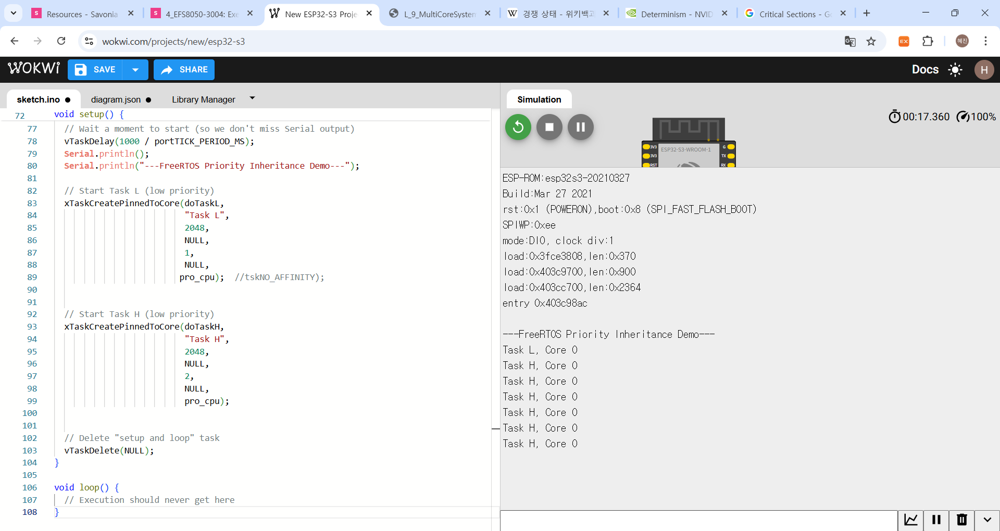
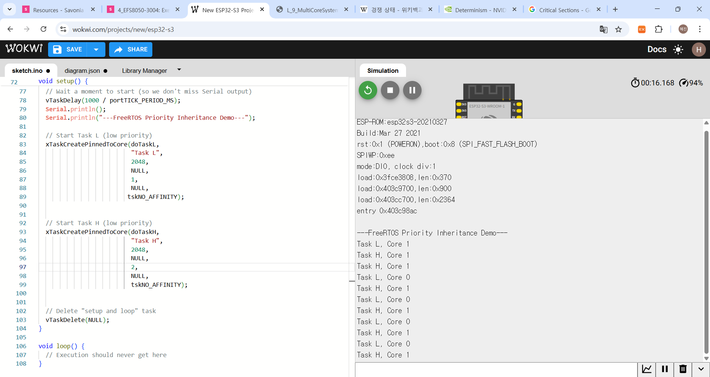

## 💻 Base Code

All cases use the following code as a base. Only the `xTaskCreatePinnedToCore` calls within the `setup()` function are modified for each case.

```cpp
#include <Arduino.h>

// Define Core variables
static const BaseType_t pro_cpu = 0; // Protocol CPU (Core 0)
static const BaseType_t app_cpu = 1; // Application CPU (Core 1)

// Set CPU hog time
static const TickType_t time_hog = 200;

/**
 * @brief Delay function that consumes CPU time (unlike vTaskDelay).
 * @param ms Approximate milliseconds to delay
 */
static void hog_delay(uint32_t ms) {
  for (uint32_t i = 0; i < ms; i++) {
    for (uint32_t j = 0; j < 40000; j++) {
      asm("nop"); // No operation (consumes CPU cycles)
    }
  }
}

/**
 * @brief Task L (Low Priority) - Priority 1
 */
void doTaskL(void *parameters) {
  char str[20];
  while (1) {
    sprintf(str, "Task L, Core %i\r\n", xPortGetCoreID());
    Serial.print(str);
    hog_delay(time_hog);
  }
}

/**
 * @brief Task H (High Priority) - Priority 2
 */
void doTaskH(void *parameters) {
  char str[20];
  while (1) {
    sprintf(str, "Task H, Core %i\r\n", xPortGetCoreID());
    Serial.print(str);
    hog_delay(time_hog);
  }
}

/**
 * @brief Default setup() function (as used in Case A)
 */
void setup() {
  Serial.begin(115200);
  vTaskDelay(1000 / portTICK_PERIOD_MS);
  Serial.println();
  Serial.println("---FreeRTOS Multicore Demo---");

  // The last parameter (Core) of the two lines below is changed for each case.
  xTaskCreatePinnedToCore(doTaskL, "Task L", 2048, NULL, 1, NULL, pro_cpu);
  xTaskCreatePinnedToCore(doTaskH, "Task H", 2048, NULL, 2, NULL, pro_cpu);

  vTaskDelete(NULL); // Delete the setup/loop task
}

void loop() {
  // This function will not be called while FreeRTOS is running.
}
````

-----

## 🚀 Experiment Cases

### Case A: Pinned to Same Core (Core 0)

Both Task L and Task H are pinned to `pro_cpu` (Core 0).



**Code modification in `setup()`:**

```cpp
  xTaskCreatePinnedToCore(doTaskL, "Task L", 2048, NULL, 1, NULL, pro_cpu);
  xTaskCreatePinnedToCore(doTaskH, "Task H", 2048, NULL, 2, NULL, pro_cpu);
```

**Expected Result:**

  * Both tasks will print that they are running on "Core 0".
  * `Task H` (Priority 2) will preempt `Task L` (Priority 1), causing `Task H` to print more frequently.
  * No resets will occur.


### Case B: Pinned to Split Cores (Core 0 / Core 1)


`Task L` is pinned to `pro_cpu` (Core 0), and `Task H` is pinned to `app_cpu` (Core 1).

**Code modification in `setup()`:**

```cpp
  xTaskCreatePinnedToCore(doTaskL, "Task L", 2048, NULL, 1, NULL, pro_cpu);
  xTaskCreatePinnedToCore(doTaskH, "Task H", 2048, NULL, 2, NULL, app_cpu);
```

  * `Task L` will print "Core 0" and `Task H` will print "Core 1".
  * Because the tasks are running in parallel on different cores, their priorities do not matter. They will print at roughly the same, regular interval.
  * No resets will occur.

### Case C: No Core Affinity (tskNO\_AFFINITY)


The `tskNO_AFFINITY` option is used, allowing the FreeRTOS scheduler to assign cores freely.

**Code modification in `setup()`:**

```cpp
  xTaskCreatePinnedToCore(doTaskL, "Task L", 2048, NULL, 1, NULL, tskNO_AFFINITY);
  xTaskCreatePinnedToCore(doTaskH, "Task H", 2048, NULL, 2, NULL, tskNO_AFFINITY);
```

**Expected Result:**

  * The scheduler may assign both tasks to Core 0 or Core 1, or split them. The assignment can vary between reboots.
  * Runtime migration (switching cores while running) is uncommon.
  * No resets will occur.
